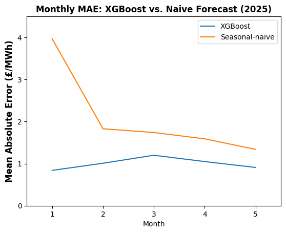

# ⚡ Price Forecasting for Ancillary Services (DCL - Dynamic Containment Low)

This repository provides a forecasting framework for predicting **Dynamic Containment Low (DCL)** auction prices in the GB electricity market using **XGBoost** model. The pipeline includes feature engineering, time-series cross-validation, hyperparameter tuning with Optuna, and long-term performance analysis against a naive benchmark.

## 🔍 Project Objective

To develop an accurate and explainable model that forecasts **day-ahead DCL auction prices** based on historical data and market signals, and compare it to a seasonal-naive benchmark (previous day's prices).

## 📦 Key Features
- ⏱ **Time-Series Cross-Validation**: Preserves temporal order in training/validation splits  
- 🔁 **Optuna-Based Hyperparameter Tuning**: Efficient optimization for XGBoost Regressor  
- 📉 **Model Evaluation**: Comparison against naive forecasts using MAE  
- 📊 **Visualizations**: Performance plots over time, actual vs. predicted analysis  
- 🗃 **Modular Structure**: Easily extendable for other ancillary services or models  
- 🧠 **Domain-Aware Features**: EFA periods, lags, and temporal features included

## 🧬 Model Architecture
- **Model**: XGBoost Regressor (`xgb.XGBRegressor`)
- **Features**: Historical auction prices, calendar features, lag values
- **Baseline**: Previous-day DCL auction prices (naive seasonal forecast)

## Key Results

  
  

## 🧪 Feature Engineering
This project includes several domain-informed features engineered from NESO data sources to enhance forecasting accuracy.

### 🔧 Operational Planning Margin Requirements
- **Source**: [NESO: Planning Margins](https://www.neso.energy/data-portal/daily-opmr)  
- See also: [Margin Analysis Notebook](https://github.com/SwatiInd/UK-Power-Analysis/blob/main/Operational_planning_margin.ipynb)  
- Represents system-level operational buffer, which impacts reserve pricing behavior.

### ⚖️ Balancing Reserve (BR) Prices
- **Source**: [NESO: BR Auction Results](https://www.neso.energy/data-portal/eac-br-auction-results)
- **Resampling**: Converted from half-hourly to 4-hourly windows using:
  - **Minimum**, **maximum**, and **mean** prices
- **Rationale**: BR auctions (at 08:15) occur before FR auctions (14:00), making BR pricing a strong lead indicator for DCL (Dynamic Containment Low) prices.
- Both **positive** and **negative** BR prices are included.

### 📉 Historic Demand Forecast
- **Source**: [NESO: Day-Ahead Demand Forecast](https://www.neso.energy/data-portal/1-day-ahead-demand-forecast/historic_day_ahead_demand_forecasts)
- **Method**:
  - Original forecasts available only at cardinal points
  - Interpolated to half-hourly frequency, then aggregated to 4-hourly min, max, and mean values

### 📊 Frequency-Response (FR) Historical Prices
- **Source**: [NESO: FR Auction Results](https://www.neso.energy/data-portal/eac-auction-results)
- Includes prices and volumes for: Dynamic Containment (DC), Quick Reserve (QR), Dynamic Moderate (DM), Dynamic Regulation (DR)
- **Temporal analysis**:
  - **Autocorrelation**: Analyzes how DCL prices relate to their own values over the past 7 days
  - **Cross-correlation**: Measures how DCL relates to other FR products (QR, DM, etc.)

These engineered features are combined to form the model's input matrix and help capture key patterns and signals relevant to DCL price formation.

## 🗂️ Repository Structure

<pre>
frcast/
├── data/                                          # Scripts to download, clean, and prepare features/targets
├── model/                                         # Model training, tuning (Optuna), and evaluation logic
├── figures/                                       # Generated figures for forecasts and error analysis
├── model_peformance_evaluation.ipynb              # Jupyter notebooks for experimentation and visualization
├── main.py                                        # Entry script: runs full pipeline for the next day 
├── requirements.txt                               # Python package dependencies
└── README.md                                      # Project overview and instructions
</pre>
